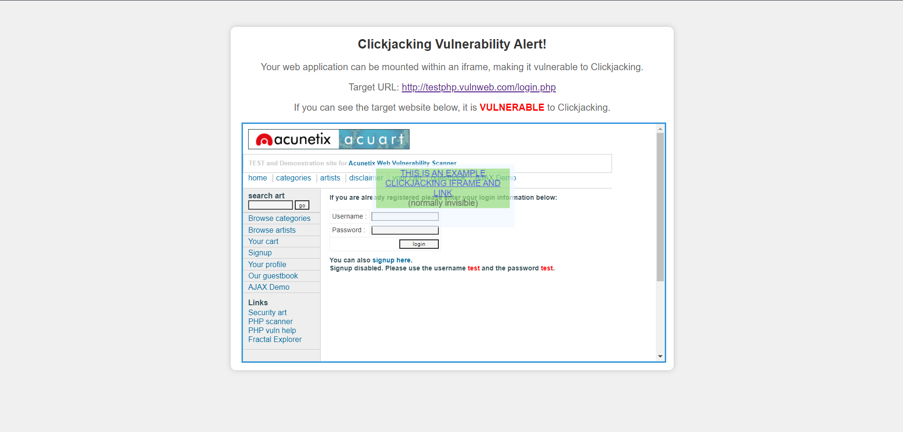
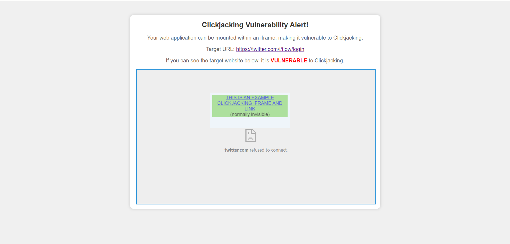

# Clickjacking Vulnerability Tester

This script is designed to assess the vulnerability of a web page to clickjacking attacks.

## Description
The script renders the target website within an iframe and overlays it with an example attack iframe. It is inspired by the proof-of-concept HTML boilerplate provided by OWASP (https://www.owasp.org/index.php/Testing_for_Clickjacking_(OTG-CLIENT-009)#How_to_Test).

## Requirements
- Python3

## Usage
To test a web page for clickjacking vulnerability, run the script as follows:
`python3 cj.py <url>`

### Output
Creates two html pages: 
* target.html - the page that will be automatically opened in your browser
* attacker.html - a page that generates our sample attacking iframe

* ### When the page is vulnerable:

* ### When the page is not vulnerable (may also appear blank):

